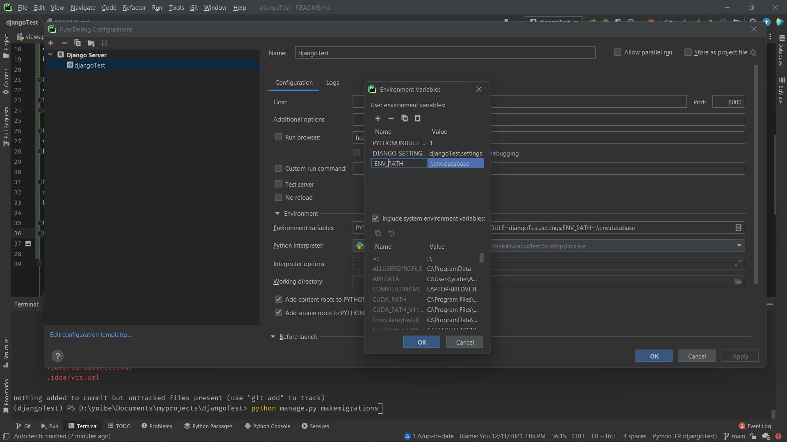
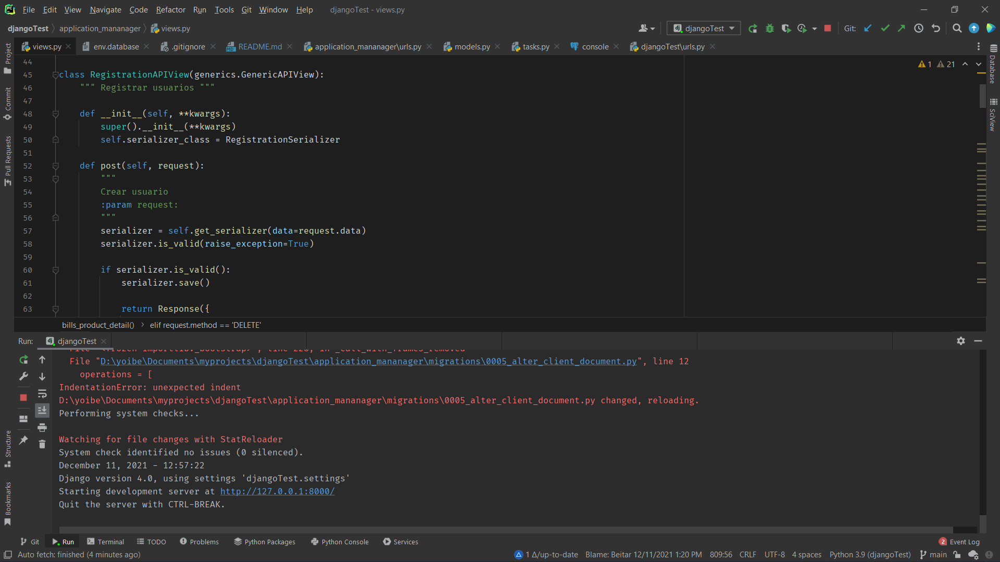
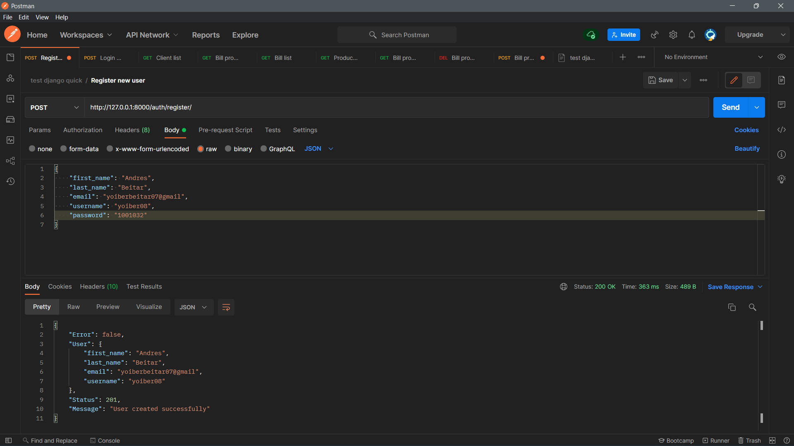
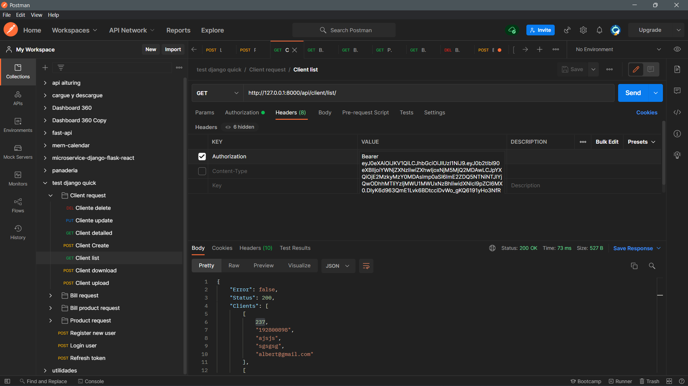

# test-django-quick
***
Prueba de desarrollo back-end Quick

## Comenzando
Clonar repositorio de github **git clone https://github.com/yoiber21/test-django-quick.git**

* Crear entorno virtual 
* Activar entorno 

## Pre-requisitos
***
* Requisitos para despleagar el proyecto.
* Instalar los requerimientos: **pip install requiriments.txt**.
* Conexion  base de datos: **Editar el archivo env.databse** con sus credenciales la variable **BASE_URL**.
* **postman** o cualquier cliente que uses.

## Instalacion
*** 
Para desplegar el pryecto para hacer las migraciones a la base de datos

### windows
***
Si utilizas pycharm para agregar la variable de entorno ruta:  **Run/Debug Configurations** --> **Enviroment variables** --> **User Enviroment variables** -->
**+** --> campo name escribe **ENV_PATH** --> campo value escribe **.\env.database**

### Terminal
***
Escribir primero **$env:ENV_PATH=".\env.database"** esto para agregar las credenciales al entorno ---> **python manage.py makemigrations** ---> **python manage.py migrate** ---> **python manage.py runserver**

### Linux
***
Para linux migrar base de datos **ENV_PATH=env.database python manage.py makemigrations** ---> **ENV_PATH=env.databasepython manage.py migrate** ---> **ENV_PATH=env.database python manage.py runserver**

# ## Dcoker
***
* Agregar credenciles del enviromet en windows **$env:ENV_PATH=".\env.database"**
* docker-compose up
Hasta finalizar.

### Screenshot

### Despliegue

***
**Nota** cada una de las peticiones a los endpoints la subire con postman
### Construido con 
* django
* djangorestframework
* python
* postgreSQL
* postman
* jsonwebtoken

### Peticiones postman
* **Crear usuario** http://127.0.0.1:8000/auth/register/

***

* **Login** http://127.0.0.1:8000/auth/login/

***
Esto nos dara un token campo access y un token de refresco que al finalizar el tiempo de duaracion del token access se accede a la url **http://127.0.0.1:8000/auth/refresh-token/**.
**Los token tiene una duracion de 160 minutos**

##### Ejemplo de utilizacion del rfresh token
***
Se envia un campo llamado refresh con el valor de refresh que se envia al loguearse.

### Como utiliziar el token para las endpoints de cada entidad
El token se envia por Headers tal y como esta en la foto El campo KEY es Authorization y VALUE Tendra Bearer*tokenvalue notese que despues de Bearer simpre debe de ir un espacio solo un espacio por eso pongo el asteric.

## Postman

***
Le envio la collection de postman para probar **https://go.postman.co/workspace/My-Workspace~25e9f404-1031-48f0-8e48-5658c2f64d73/collection/13306518-b2a9d595-81db-4f51-8540-aee94f0c7108**